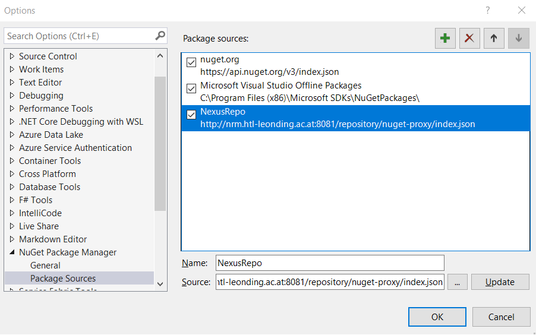

# Nexus-Repository  
  
Damit Visual Studio die **Nuget-Packages** auch ohne Internet laden kann, muss eine Aenderung in der Einstellung vorgenommen werden. Die nachfolgende Anleitung beschreibt die Aenderung Schritt fuer Schritt.  
  
## Aenderung der Einstellung - Package Sources  
  
Die Einstellung **Package Sources** gibt an, von welchem Server die Nuget-Packages geladen werden. Um diese Einstellung zu aendern, fuehren Sie nun die folgenden Schritte durch:  
  
* Visual Studio starten  
* Aktivieren Sie den Menuepunkt **Tools -> Optionen...**  
* Geben Sie im Suchfeld '**nuget**' ein  
* Waehlen Sie den Eintrag '**Package Sources**' aus  
* Fuegen Sie einen Eintrag mit '**+**' hinzu und bennenen Sie diesen mit '**NexusRepo**'  
* Geben Sie im Feld Source: http://nrm.htl-leonding.ac.at:8081/repository/nuget-proxy/index.json  
ein  
* Bestaetigen Sie den Eintrag mit dem Button 'Update'  
  
  
  
* Aktivieren Sie die Auswahl (CheckBox) `NexusRepo`  
* Deaktivieren Sie alle anderen `Package sources`  
  
**Well done**  
