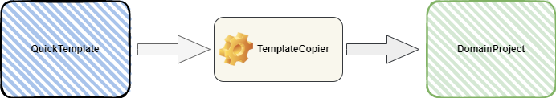
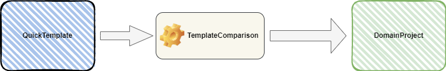

Frontend  
=============  
  
Das Projekt ***Frontend*** ist eine Vorlage fuer die Erstellung von datenzentrierten Anwendungen. Ausgehend von dieser Vorlage koennen neue Anwendungen, sogenannte Domain-Projekte, erstellt und erweitert werden.  
  
# Inhaltsverzeichnis  
1. [Infrastruktur](#infrastruktur)  
2. [Template](#template)  
3. [Entwicklerwerkzeuge](#entwicklerwerkzeuge)  
4. [Verwendung der Vorlage](#verwendung-der-Vorlage)  
   1. [Projekterstellung](#projekterstellung)  
   2. [Abgleich mit dem Frontend](#abgleich-mit-dem-Frontend)  
5. [Umsetzungsschritte](#umsetzungsschritte)  
  
## Infrastruktur  
  
Zur Umsetzung des Projektes wird DotNetCore (6.0 und hoeher) als Framework, die Programmiersprache CSharp (C#) und die Entwicklungsumgebung Visual Studio 2022 Community verwendet. Alle Komponenten koennen kostenlos aus dem Internet heruntergeladen werden.  
  
In diese Dokumentation werden unterschiedliche Begriffe verwendet. In der nachfolgenden Tabelle werden die wichtigsten Begriffe zusammengefasst und erlaeutert:  
  
|Begriff|Bedeutung|Synonym(e)|
|---|---|---|
|**Solution**|Ist eine Zusammenstellung von verschiedenen Teilprojekten zu einer Gesamtloesung.|Gesamtloesung, Loesung, Projekt|
|**Domain Solution**|Damit ist eine Gesamtloesung gemeint, welches fuer einen bestimmten Problembereich eine Loesung darstellt.|Problemloesung, Projekt|
|**Teilprojekt**|Ist die Zusammenstellung von Klassen und/oder Algorithmen, welches eine logische Einheit fuer die Loesungen bestimmter Teilprobleme bildet.|Teilloesung, Projekteinheit, Projekt|
|**Projekttyp**|Unter Projekttyp wird die physikalische Beschaffenheit eines Projektes bezeichnet. Es gibt zwei grundlegende Typen von Projekten:<br>   - Ein wiederverwendbares Projekt (wie eine Bibliothek) und <br>  - ein ausfuehrbares Projekt (Konsolenanwendung, WepApi, AspMvc usw.). <br>**Als Regel gilt:**<br> Alle Programmteile werden in *wiederverwendbaren Projekten* implementiert. Die ausfuehrbaren Einheiten dienen nur als Startprojekte und leiten die Anfragen an die *wiederverwendbaren Projekt-Komponenten* weiter.|Bibliothekstyp, Consolentyp|
|**Library oder Bibliothek**|Kennzeichnet einen *wiederverwendbaren Projekttyp*.|Bibliothek|
|**Console**|Kennzeichnet einen *ausfuehrbaren Projekttyp*. Dieser Typ startet eine Konsole fuer die Ausfuehrung.|Konsole|
|**Host**|Dieser Typ kennzeichnet ein *ausfuehrbares Projekt*, welches zum Starten den IIS verwendet oder im Modus `selfhosting` gestartet werden kann.|Web-Application |
|**Abhaengigkeit**|Die Abhaengikeit beschreibt die Beziehungen von Projekten untereinander. Benoetigt ein *Projekt A* Funktionalitaeten aus einem andern *Projekt B*, so wird eine Projektreferenz vom *Projekt B* in *Projekt A* benoetigt.|Projektreferenz, Referenz, Dependency, Projektverweis|
  
## Template  
Die Struktur vom 'Frontend' besteht aus unterschiedlichen Teilprojekten und diese in einer Gesamtloesung (im Kontext von Visual Studio ist das eine Solution) zusammengefasst. Eine Erlaeuterung der einzelnen Projekte, deren Typ und die Abhaengigkeit finden sie in der folgenden Tabelle:  
  
|Projekt|Beschreibung|Typ|Abhaengigkeit|
|---|---|---|---|
|**CommonBase**|In diesem Projekt werden alle Hilfsfunktionen und allgemeine Erweiterungen zusammengefasst. Diese sind unabhaengig vom Problembereich und koennen auch in andere Domaen-Projekte wiederverwendet werden.|Library|keine|
|**Frontend.Logic**|Dieses Projekt beinhaltet den vollstaendigen Datenzugriff, die gesamte Geschaeftslogik und stellt somit den zentralen Baustein des Systems dar.|Library|CommonBase|
|**Frontend.WebApi**|In diesem Projekt ist die REST-Schnittstelle implementiert. Diese Modul stellt eine API (Aplication Programming Interface) fuer den Zugriff auf das System ueber das Netzwerk zur Verfuegung.|Host|CommonBase, Frontend.Logic|
|**Frontend.ConApp**|Dieses Projekt dient als Initial-Anwendung zum Erstellen der Datenbank, das Anlegen von Anmeldedaten falls die Authentifizierung aktiv ist und zum Importieren von bestehenden Daten. Nach der Initialisierung wird diese Anwendung kaum verwendet.|Console|CommonBase, Frontend.Logic|
|**Frontend.AspMvc**|Diese Projekt beinhaltet die Basisfunktionen fuer eine AspWeb-Anwendung und kann als Vorlage fuer die Entwicklung einer einer AspWeb-Anwendung mit dem Frontend verwendet werden.|Host|CommonBase, Frontend.Logic|
|**Frontend.WpfApp**|Diese Projekt beinhaltet die Basisfunktionen fuer eine Wpf-Anwendung und kann als Vorlage fuer die Entwicklung einer einer Wpf-Anwendung mit dem Frontend Framework verwendet werden.|Host|CommonBase, Frontend.Logic|
|**Frontend.XxxYyy**|Es folgen noch weitere Vorlagen von Client-Anwendungen wie Angular, Blazor und mobile Apps. Zum jetzigen Zeitpunkt existiert nur die AspMvc-Anwendung. Die Erstellung und Beschreibung der anderen Client-Anwendungen erfolgt zu einem spaeteren Zeitpunkt.|Host|CommonBase, Frontend.Logic|
  
## Entwicklerwerkzeuge  
Dem Entwickler stehen unterschiedliche Hilfsmittel fuer die Erstellung von Projekten zur Seite. Die wichtigsten Werkzeuge sind in der nachfolgenden Tabelle zusammengefasst:  
  
|Projekt|Beschreibung|Typ|Abhaengigkeit  
|---|---|---|---|
|**TemplateCopier.ConApp**|Diese Anwendung dient zum Kopieren der Vorlage ***'Frontend'***. Diese Vorlage dient als Basis fuer zukuenftige Projekte und muss entsprechend kopiert werden. Die Anwendung ***TemplateCopier.ConApp*** kopiert alle Teilprojekte aus der Vorlage ***'Frontend'*** in das angegebenen Zielverzeichnis und fuehrt eine Umbenennung der Komponenten durch.|Console|CommonBase  
|**TemplateComparsion.ConApp**|Dieses Projekt dient zum Abgleich der Vorlage ***'Frontend'*** mit den bereits erstellten ***'Domain-Projekten'***. Alle Dateien welche dem Label `@CodeCopy` in der Vorlage ***'Frontend'*** gekennzeichnet sind werden mit den Dateien im ***'Domain-Projekten'*** mit dem Label `@CodeCopy` abgeglichen.|Console|CommonBase  
|**TemplatePreprocessor.ConApp**|Dieses Projekt dient zum Setzen der Definitionen (z.B. ACCOUNT_ON usw.) in der entspechenden Solution.|Console|CommonBase  
  
# Verwendung der Vorlage  
  
Nachfolgend werden die einzelnen Schritte von der Vorlage ***Frontend*** bis zum konkreten Projekt ***QTMusicStoreLight*** erlaeutert. Das Projekt ist eine einfache Anwendung zur Demonstration von der Verwendung der Vorlage. Im Projekt ***QTMusicStoreLight*** werden Kuenstler (Artisten) und deren produzierten Alben verwaltet. Jedes Album hat ein Genre (Rock, Pop, Klassik usw.) zugeordnet. Ein Datenmodell ist im nachfolgendem Abschnitt definiert.  
   
## System-Erstellungs-Prozess  
  
Wenn nun ein einfacher Service oder eine Anwendung entwickelt werden soll, dann kann die Vorlage ***Frontend*** als Ausgangsbasis verwendet und weiterentwickelt werden. Dazu empfiehlt sich folgende Vorgangsweise:  
  
### Vorbereitungen  
  
- Erstellen eines Ordners (z.B.: Develop)  
- Herunterladen des Repositories ***Frontend*** vom [GitHub](<https://github.com/leoggehrer/CSTemplate-Frontend>) und in einem Ordner speichern.  
  
> **ACHTUNG:** Der Solution-Ordner von der Vorlage muss ***Frontend*** heißen.  
  
### Projekterstellung  
Die nachfolgenden Abbildung zeigt den schematischen Erstellungs-Prozess fuer ein Domain-Projekt:  
  
  
  
Als Ausgangsbasis wird die Vorlage ***Frontend*** verwendet. Diese Vorlage wird mit Hilfe dem Hilfsprogramm ***'TemplateCopier.ConApp'*** in ein Verzeichnis eigener Wahl kopiert. In diesem Verzeichnis werden alle Projektteile (mit Ausnahme der Hilfsprogramme *TemplateCopier.ConApp*, *TemplateComparison.ConApp* und *TemplatePreprocessor.ConApp*) von der Vorlage kopiert und die Namen der Projekte und Komponenten werden entsprechend angepasst. Alle Projekte mit dem Prefix ***Frontend*** werden mit dem domainspezifischen Namen des Verzeichnisses ersetzt. Beim Kopieren der Dateien von der Vorlage werden alle Dateien mit dem Label ***@CodeCopy*** durch den Label ***@CodeCopy*** gekennzeichnet. Diese Label werden fuer den Abgleich-Prozess verwendet.  
  
Zum Beispiel soll ein Projekt mit dem Namen 'QTMusicStoreLight' erstellt werden. Im 'TemplateCopier' werden folgende Parameter eingestellt:  
  
```csharp  
Template Copier
===============

Copy 'Frontend' from: ...\source\repos\HtlLeo\CSSoftwareEngineering\Frontend
Copy to 'QTMusicStoreLight':   ...\source\repos\HtlLeo\CSSoftwareEngineering\QTMusicStoreLight

[1] Change source path
[2] Change target path
[3] Change target solution name
[4] Start copy process
[x|X] Exit

Choose: 4
```  
  
**Hinweis:** Die Vorlage muss im Ordner (*Frontend*) gespeichert sein.  
  
Nach der Ausfuehren der Option ***'[4] Start copy process'*** befindet sich folgende Projektstruktur im Ordner **...\QTMusicStoreLight**:  
  
- CommonBase  
- QTMusicStoreLight.AspMvc  
- QTMusicStoreLight.ConApp  
- QTMusicStoreLight.Logic  
- QTMusicStoreLight.WebApi  
- QTMusicStoreLight.WpfApp  
  
Im Projekt ***Frontend*** sind alle Code-Teile, welche als Basis-Code in andere Projekte verwendet werden, mit einem Label ***@CodeCopy*** markiert. Dieser Label wird im Zielprojekt mit dem Label ***@CodeCopy*** ersetzt. Das hat den Vorteil, dass Aenderungen in der Vorlage auf die bereits bestehenden Projekte uebertragen werden koennen (naehere Informationen dazu gibt es spaeter).  
  
> **ACHTUNG:** Im Domain-Projekt duerfen keine Aenderungen von Dateien mit dem Label ***@CodeCopy*** durchgefuehrt werden, da diesen beim naechsten Abgleich wieder ueberschrieben werden. Sollen dennoch Aenderungen vorgenommen werden, dann muss der Label ***@CodeCopy*** geaendert (z.B.: @CustomCode) oder entfernt werden. Damit wird diese Datei vom Abgleich mit der Verlage ausgeschlossen.  
  
## Abgleich mit dem Frontend  
  
In der Software-Entwicklung gibt es immer wieder Verbesserungen und Erweiterungen. Das betrifft die Vorlage ***Frontend*** genauso wie alle anderen Projekte. Nun stellt sich die Frage: Wie koennen Verbesserungen und/oder Erweiterungen von der Vorlage auf die *Domain-Projekte* uebertragen werden?  
In der Vorlage sind die Quellcode-Dateien mit den Labels ***@CodeCopy*** gekennzeichnet. Beim Kopieren werden diese Labels durch den Label ***@CodeCopy*** ersetzt. Mit dem Hilfsprogramm *TemplateComparison.ConApp* werden die Dateien mit dem Label ***@CodeCopy*** und ***@CodeCopy*** abgeglichen. In der folgenden Skizze ist dieser Prozess dargestellt:  
  
  
  
Fuer den Abgleichprozess muessen im Projekt ***TemplateComparsion.ConApp*** in der Datei ***Program.cs*** folgende Eintellungen definiert werden:  
  
```csharp  
    // Frontend-Projects  
    TargetPaths = new string[]  
    {  
        Path.Combine(UserPath, @"source\repos\HtlLeo\CSSoftwareEngineering\QTMusicStoreLight"),  
    };  
    // End: Frontend-Projects  
```  
  
Im naechsten Schritt wird die Anwendung ***TemplateComparsion.ConApp*** gestartet. Der folgende Benutzer-Dialog wird angezeigt:  
  
```csharp  
TemplateComparison:  
===================  
  
Source: ...\source\repos\HtlLeo\CSSoftwareEngineering\Frontend\  
  
   Balancing for: [ 1] ...\source\repos\HtlLeo\CSSoftwareEngineering\QTMusicStoreLight  
   Balancing for: [ a] ALL  
  
  
Balancing [1..1|X...Quit]:  
```  
  
Wird nun die Option **[1 oder a]** aktiviert, dann werden alle Dateien in der Solution **Frontend** mit der Kennzeichnung `@BaseCopy` mit den Dateien in der Solution  **QTMusicStoreLight** mit der Kennzeichnung `@CodeCopy` abgeglichen.  
  
# Umsetzungsschritte  
  
Nachdem nun das Domain-Projekt **QTMusicStoreLight** erstellt wurde, werden nun folgende Schritte der Reihenfolge nach ausgefuehrt:  
  
**Erstellen des Backend-Systems**  
  
- Erstellen der ***Enumeration***  
  - ...  
- Erstellen der ***Entitaeten***  
  - ...  
- Definition des ***Datenbank-Kontext***  
  - *DbSet&lt;Entity&gt;* definieren  
  - ...  
  - partielle Methode ***GetDbSet<E>()*** implementieren  
- Erstellen der ***Kontroller*** im *Logic* Projekt  
  - ***EntityController*** erstellen  
  - ...  
- Erstellen der ***Datenbank*** mit den Kommandos in der ***Package Manager Console***  
  - *add-migration InitDb*  
  - *update-database*  
- Implementierung der ***Business-Logic***  
- Erstellen des UnitTest-Projekt mit der Bezeichnung ***QTMusicStoreLight.Logic.UnitTest***  
  - Ueberpruefen der Geschaeftslogik mit ***UnitTests***  
- Importieren von Daten (optional)  
  
**Erstellen der AspMvc-Anwendung**  
  
- Erstellen der Models  
  - ...  
- Erstellen der Kontroller  
  - ...  
- Erstellen der Ansichten  
  - ...  
  
**Erstellen des RESTful-Services**  
  
- Erstellen der Models  
  - ...  
- Erstellen der Kontroller  
  - ...  
  
Die einzelnen Schritte sind im [Github-QTMusicStoreLight](https://github.com/leoggehrer/CSSoftwareEngineering-QTMusicStoreLight) detailiert aufgefuehrt.  
  
**Viel Spaß beim Umsetzen der Aufgabe!**  
