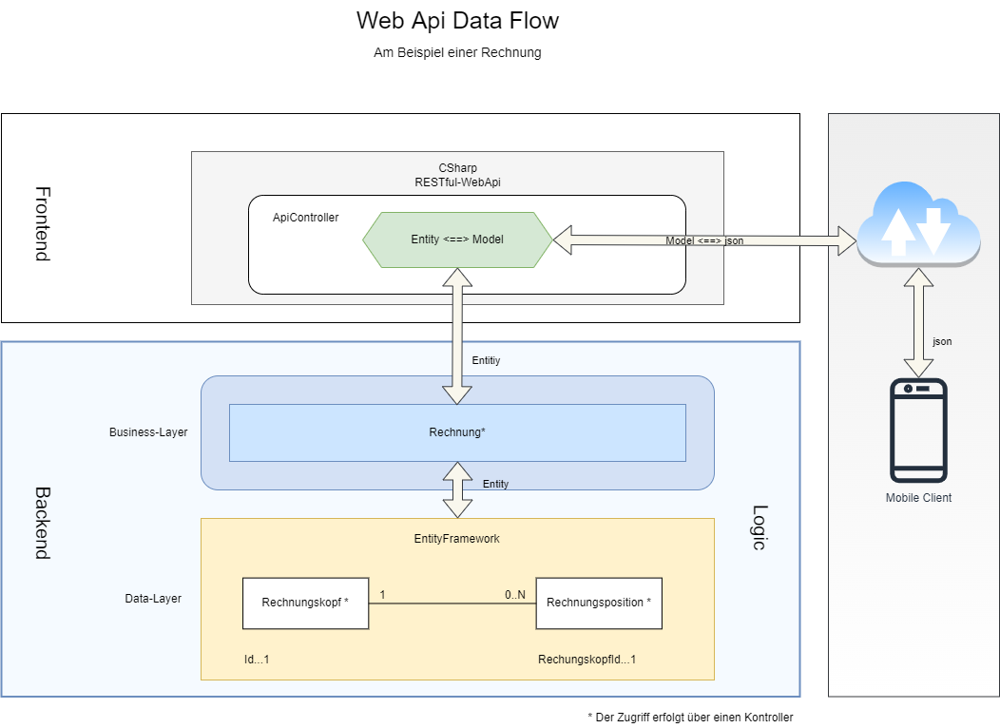

RESTful-Service WebApi  
======================  
  
Mit dem WebApi-Framework koennen sehr einfach ***RESTful-Services*** erstellt werden. ***RESTful-Service*** stellen einen Zugriff außerhalb des Prozessraumes auf den Backend zur Verfuegung und bietet somit eine flexible Moeglichkeit, mit dem Backend zu kommunizieren. So koennen, zum Beispiel, mobile Endgeraete ueber das Internet Anfragen an den Backend senden und die entsprechende Antworten auswerten. Neben der flexiblen Kommunikation bietet der ***RESTful-Service*** auch die Moeglichkeit, dass das Gesamtsystem leichter skaliert werden kann.  
Die Verknuepfung der einzelnen Komponenten erfolgt ueber den Datenaustausch mit unterschiedlichen Formaten. In letzter Zeit hat sich das json-Format als das wichtigste Uebertragungsformat fuer diese Service-Typ etabliert.  
  
## Funktionsweise  
  
Der ***RESTful-Service*** transformiert die HTTP-Anfragen (GET, POST, PUT, DELETE usw.) sowie deren Daten in Objekte und leitet diese an die entsprechenden Methoden des Backends weiter. Der Backend reagiert auf diese Anfragen und generiert Antwort-Objekte. Diese Objekte werden vom ***RESTful-Service*** entgegen genommen und wiederum in einen Datenstrom konvertiert. Dieser Datenstrom wird im Anschluß an den Transformationsprozesses an die Endstelle weitergeleitet.  
  
### Aufloesung der Anfrage  
  
Eine Anforderung an den ***RESTful-Servcie*** erfolgt ueber eine Url. Diese Url wird vom Framework ausgewertet und an die entsprechenden Komponenten des Services weitergeleitet. Die Aufloesung der Url erfolgt in:  
  
- Server  
- Kontroller  
- Aktion (mit und ohne Parameter)  
  
Zum Beispiel wird die Url https://musicstorelight.com/api/genres mit dem Http-Verb-Get wie folgt aufgeloest:  
  
- https://musicstorelight/api  
- genres  
  
Der Server-Teil ist die Adresse des Host-Servers und ist fuer den WebApi-Framework ohne Bedeutung. Im zweiten Teil ist der Kontroller adressiert. Diese Information weist den Framework an, fuer die Anfrage den Kontroller ***GenresController*** zu verwenden. Dieser Kontroller befindet sich im Abschnitt ***Controllers*** und muss nach der Nameskonvention mit **Controller** enden. Das Http-Verb-Get informiert den Framework darueber, dass eine Methode ohne Parameter mit diesem Http-Verb die Anfrage uebernimmt und auswertet.   
  
## Ablauf und Interaktion  
  
In der nachfolgenden Skizze ist der Ablauf schematisch dargestellt:  
  
  
  
